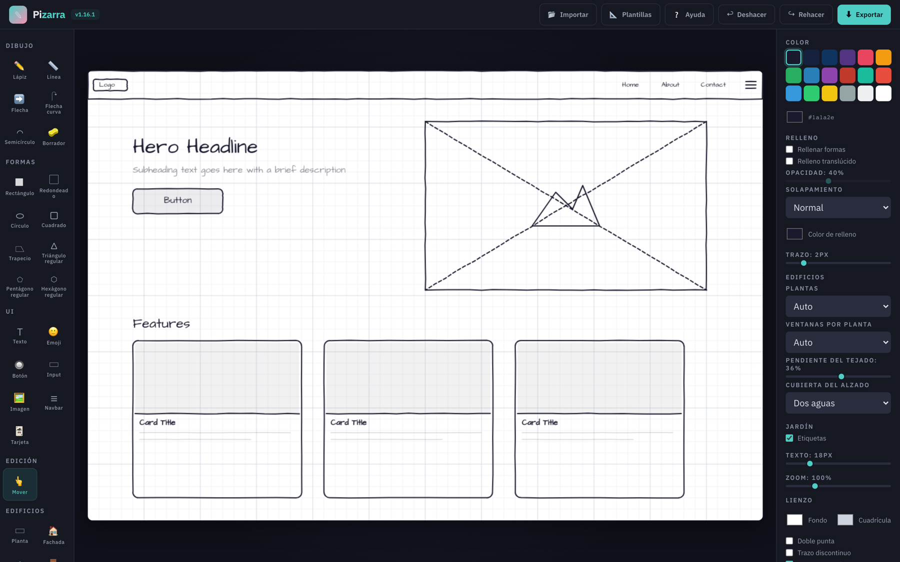
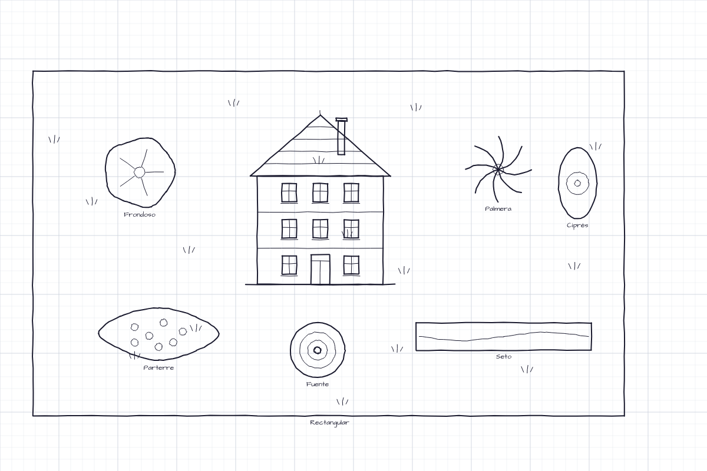

<div align="center">

# ✎ Pizarra

**Wireframes, diagramas y bocetos con estética dibujada a mano — en el navegador y sin instalar nada.**

[](CHANGELOG.md)
[](src/js/)
[](src/scss/)
[](#arquitectura)
[](#tests)
[](LICENSE)



</div>

---

Pizarra es una aplicación de wireframing sobre `<canvas>` escrita en JavaScript puro. **Sin bundler y sin dependencias en runtime**: se clona el repositorio, se abre `index.html` y ya está funcionando. Los estilos se desarrollan en **SCSS (BEM)** y se compilan con **Gulp 5 + Sass** a `css/styles.css`, que viaja compilado dentro del repositorio — por eso usarla sigue sin pedir nada.

- **Cero fricción para usarla** — no hay `npm install` ni compilación para ejecutar la app: abrir el archivo *es* ejecutar la aplicación. Node solo hace falta para desarrollar (estilos y tests).
- **Trazo dibujado a mano, pero estable** — el temblor del estilo *sketchy* nace de un PRNG con semilla por elemento, así que el mismo dibujo se repinta idéntico en cada frame.
- **Tu trabajo es tuyo** — todo vive en el navegador (`localStorage`); nada se envía a ningún servidor. El proyecto se exporta a JSON y se vuelve a importar cuando quieras.
- **Cinco formatos de salida** — PNG, JPG, SVG, HTML y JSON.

## Índice

- [✎ Pizarra](#-pizarra)
  - [Índice](#índice)
  - [Inicio rápido](#inicio-rápido)
  - [Características](#características)
    - [Dibujo y formas](#dibujo-y-formas)
    - [Flechas de nivel diagrama](#flechas-de-nivel-diagrama)
    - [Edificios y Jardín](#edificios-y-jardín)
    - [Edición](#edición)
    - [Exportación](#exportación)
  - [Cómo usar Pizarra](#cómo-usar-pizarra)
  - [Atajos de teclado](#atajos-de-teclado)
  - [Arquitectura](#arquitectura)
    - [Principios de diseño](#principios-de-diseño)
  - [Desarrollo de estilos (SCSS + Gulp)](#desarrollo-de-estilos-scss--gulp)
  - [Tests](#tests)
  - [Documentación del proyecto](#documentación-del-proyecto)
  - [Compatibilidad](#compatibilidad)
  - [Licencia](#licencia)

## Inicio rápido

```bash
git clone https://github.com/JavierTamaritWeb/pizarra.git
cd pizarra
open index.html          # macOS · en Linux: xdg-open · en Windows: start
```

Si prefieres servirla (recomendado para probar el pegado de imágenes y la importación de archivos):

```bash
python3 -m http.server 8000     # → http://localhost:8000
```

Para *usar* la app no hay nada que instalar ni compilar: el CSS ya viene compilado. Para *desarrollar* estilos o pasar los tests, ver [Desarrollo de estilos](#desarrollo-de-estilos-scss--gulp) y [Tests](#tests).

## Características

### Dibujo y formas

| | |
| --- | --- |
| **Trazo a mano alzada** | Lápiz, línea, flecha y flecha curva con jitter determinista: cada elemento guarda su semilla y no "tiembla" entre repintados. |
| **Formas** | Rectángulo, redondeado, elipse, cuadrado, trapecio, triángulo, pentágono y hexágono. Los polígonos regulares se arrastran desde el centro y conservan sus lados iguales; el trapecio admite proporciones libres. |
| **Semicírculos** | 180° exactos y sin puntas. El arrastre fija el diámetro; después `+`/`−` o su handle ajustan el radio manteniendo la media circunferencia. `Q` convierte una flecha curva en semicírculo y viceversa. |
| **Relleno** | Color propio por forma, modo sólido o translúcido y opacidad del 0 al 100 %. Vaciar una forma no le hace perder el color: al volver a rellenarla recupera el mismo. |
| **Solapamiento** | El modo **Bordes ocultos** vuelve discontinuos solo los tramos del contorno inferior que otra forma tapa, respetando el orden de capas. |
| **Componentes UI** | Botón, input, imagen, navbar y tarjeta, con etiquetas editables (doble clic). |
| **Emoji e imágenes** | Catálogo de 60 emoji en cinco categorías; imágenes pegadas con `Ctrl/Cmd+V` o arrastradas desde el escritorio. |
| **Borrador real** | Borra **lo que se ve**, no la caja: una forma sin relleno se borra por su contorno, así que barrer entre las ventanas de una fachada no se lleva el muro. Recta, flecha y trazo a mano se **recortan** en vez de desaparecer enteros —pasar por la mitad de una línea, o por donde se cruzan dos trazos, solo borra ese tramo—; el resto de elementos se elimina de verdad —lo borrado no reaparece al mover el dibujo ni viaja oculto dentro del archivo exportado— y cada pasada se deshace como una sola acción. Tamaño ajustable de 4 a 100 px: al elegir la herramienta se abre un modal con previsualización, reabrible luego con el botón ⚙ del panel. |
| **Plantillas** | Landing page, dashboard y formulario, para empezar con estructura. |

### Flechas de nivel diagrama

- **Curvatura con handle**: `Shift` al trazar comba hacia el otro lado, `F` invierte el giro, `+`/`−` ajustan la intensidad y el doble clic en el handle la resetea.
- **Curvas encadenadas**: cada clic añade un tramo continuo y `Ctrl`/`Cmd`+clic termina la cadena con la punta; `Retroceso` deshace el último tramo y `Esc` cancela.
- **Conectores anclados**: suelta un extremo sobre un elemento y la flecha se pega a su borde — al moverlo o redimensionarlo, la flecha lo sigue conservando su curvatura.
- **Etiquetas sobre el trazo**, desplazables a lo largo de la curva, más doble punta, trazo discontinuo, grosor por elemento y dirección invertible (`D`).

### Edificios y Jardín

Dos secciones para bocetar arquitectura y entorno con la misma estética. Ninguna introduce tipos de elemento nuevos: cada arrastre produce líneas, rectángulos, círculos, curvas y texto corrientes, así que la exportación, el undo y el JSON funcionan igual que con el resto del dibujo.



**Edificios** (alzado) — planta, fachada, tejado, puerta, ventana y balcón. La fachada abre un modal con **miniatura en vivo**, tres vistas y los ajustes de plantas, ventanas por planta, pendiente y cubierta, todos sincronizados con el panel lateral. El balcón trae **8 tipos** y su catálogo, como los del jardín, usa **el dibujo real como icono**.

**Jardín** (vista de planta) — parcela, árboles, arbustos, flores, decoración, caminos y aromáticas: **46 variantes** en siete catálogos. En los catálogos **el icono es el dibujo real**, porque lo pinta la misma geometría que crea la herramienta: no puede engañar.

Cada edificio y cada pieza de jardín se crea como una **unidad** — un clic la selecciona entera para mover, duplicar o borrar, y `Alt`+clic aísla una parte.

<details>
<summary><b>Ver el catálogo completo</b></summary>

| Herramienta | Variantes |
| --- | --- |
| **Planta** (`W`) | Rectangular · en L · en U con jardín · claustro |
| **Fachada** (`1`) | De frente · con tejado · de lado — multiplanta, con la puerta y las ventanas del tipo elegido |
| **Tejado** (`2`) | Dos aguas · un agua · plano · cuatro aguas · mansarda (todos con tejas) |
| **Puerta** (`0`) | Normal · arco · doble · paneles · garaje · y sus versiones solo-marco |
| **Ventana** (`Y`) | Normal · arco · doble · rejilla · óculo · y sus versiones solo-marco |
| **Balcón** | De barrotes · francés · de forja · balaustrada · corrido · acristalado · terraza · mirador |
| **Jardín** (`8`) | Parcela rectangular · cuadrada · redonda · en L · orgánica, con textura de césped |
| **Árbol** (`9`) | Frondoso · conífera · palmera · olivo · almendro · algarrobo · frutal · ciprés |
| **Arbusto** (`H`) | Mata redonda · seto · macizo · topiario · adelfa · boj recortado · lentisco |
| **Flor** (`X`) | Margarita · rosa · tulipán · parterre · girasol |
| **Decoración** (`Z`) | Maceta · pozo · regadera · piedra · banco · fuente · reloj de sol (de suelo o de pared) · estanque |
| **Caminos** | Serpenteante o recto, liso o empedrado — las cuatro combinaciones. Del arrastre salen las dos cosas: el **recorrido** por el lado largo y el **grosor** por el corto. Marcando **«Cualquier inclinación»** el recorrido sigue el ángulo exacto del gesto —rotulado junto al puntero mientras arrastras— y el **ancho** pasa a su deslizador, con miniatura en vivo. Todo desde el propio catálogo y sin mantener ninguna tecla |
| **Aromáticas** | Lavanda · romero · tomillo · salvia · santolina · agave · aloe · chumbera |

Cada pieza de jardín nace con una **etiqueta** que la nombra, dentro del mismo grupo (se mueve y se borra con ella); se apaga con la casilla «Etiquetas» del panel. El tamaño por defecto depende del tipo: un seto o un camino nacen alargados, una flor suelta menuda.

</details>

### Edición

- **Selección múltiple** con `Shift`+clic, marquee o `Ctrl/Cmd+A`; el grupo se arrastra desde cualquier punto de su marco combinado, incluido el espacio vacío entre elementos.
- **Rotación por pasos** (`Shift+R`): cuadrados 45°, trapecios/triángulos/rectángulos 90°, pentágonos 36°, hexágonos 30°. En una selección múltiple cada forma usa su propio paso.
- **Copiar y pegar** (`Ctrl/Cmd+C` / `V`), también entre pestañas: lo pegado aparece desplazado, queda seleccionado y las flechas ancladas se re-vinculan a sus clones.
- **Undo/redo** con historial de 50 pasos.
- **Cuadrícula** con ajuste opcional (`Alt` lo desactiva al vuelo) y **zoom 30–300 %** con auto-ajuste al espacio disponible en pantallas anchas.
- **Fondo y color de cuadrícula** personalizables, con persistencia entre sesiones.
- **Autoguardado** en `localStorage`: el trabajo sobrevive al refresco.
- **Interfaz responsive**: la barra de herramientas pasa a dos columnas desde 1201 px y el panel se convierte en un cajón deslizable por debajo de 1100 px.

### Exportación

| Formato | Detalle |
| --- | --- |
| **PNG / JPG** | Imagen rasterizada del lienzo limpio |
| **SVG** | Vectorial escalable, fiel al render |
| **HTML** | Página editable con componentes reales + SVG incrustado para los trazos |
| **JSON** | Proyecto reutilizable — expórtalo e impórtalo después, con validación por tipo de elemento |

## Cómo usar Pizarra

1. Elige una herramienta en la barra lateral o con su atajo de teclado.
2. Dibuja sobre el lienzo. Con **Mover** (`V`) seleccionas, desplazas, redimensionas y duplicas.
3. Ajusta color, grosor, relleno, cuadrícula y zoom desde el panel derecho. Los controles tienen doble uso: **con algo seleccionado editan la selección; sin selección fijan el valor de lo próximo que dibujes.**
4. Exporta como PNG, JPG, SVG o HTML — o guarda el proyecto como JSON para seguir más tarde.

> [!TIP]
> Pulsa `?` en cualquier momento para abrir la ayuda con todos los atajos.

## Atajos de teclado

| Atajo | Acción |
| --- | --- |
| `P` `L` `A` `U` `G` `E` | Lápiz · Línea · Flecha · Flecha curva · Semicírculo · Borrador |
| `R` `O` `C` | Rectángulo · Redondeado · Círculo |
| `3` `4` `5` `6` `7` | Triángulo · Cuadrado · Pentágono · Hexágono · Trapecio |
| `T` `J` `B` `I` `M` `N` `K` | Texto · Emoji · Botón · Input · Imagen · Navbar · Tarjeta |
| `V` | Mover / seleccionar |
| `W` `1` `2` `0` `Y` | Edificios: Planta · Fachada · Tejado · Puerta · Ventana (Balcón no tiene atajo) |
| `8` `9` `H` `X` `Z` | Jardín: Jardín · Árbol · Arbusto · Flor · Decoración (Caminos y Aromáticas van sin atajo) |
| `Ctrl/Cmd+Z` · `Ctrl+Y` o `Cmd+Shift+Z` | Deshacer · rehacer |
| `Ctrl/Cmd+D` · `Ctrl/Cmd+A` | Duplicar · seleccionar todo |
| `Ctrl/Cmd+C` · `Ctrl/Cmd+V` | Copiar selección · pegarla (o pegar una imagen del portapapeles) |
| `Shift+R` | Rotar la selección un paso |
| `Supr` · `Esc` | Borrar selección · deseleccionar |
| Flechas (+`Shift`) | Mover la selección 1 px (20 px) |
| `F` · `D` · `S` | Invertir giro · invertir dirección · curva en S |
| `Q` | Convertir flecha curva ↔ semicírculo |
| `+` · `−` (+`Shift`) | Ajustar curvatura — en semicírculos, el radio (fino) |
| `?` | Abrir la ayuda con todos los atajos |

Las herramientas que abren catálogo (Edificios y Jardín) muestran su modal de tipos al pulsar el atajo. **Balcón**, **Caminos** y **Aromáticas** son las únicas sin atajo: ya no queda ninguna tecla suelta libre.

## Arquitectura

```text
index.html               Shell de la app (carga src/js/ en orden de dependencia)
css/styles.css           Estilos compilados (artefacto de src/scss/ — no editar a mano)
fonts/                   OpenDyslexic autoalojada (woff2 + licencia SIL OFL)
icons/                   Favicon, apple-touch, maskable, logo de la topbar + PNG fuente
favicon.ico              Icono multi-resolución (16/32/48) en la raíz
site.webmanifest         Manifiesto: nombre, colores e iconos para instalar la app
src/
├── scss/                Fuente de los estilos: SCSS con BEM
│   ├── abstracts/       _variables (tokens), _fonts (tipografías), _breakpoints, _mixins
│   ├── base/            _tokens (custom properties), _reset, _focus, …
│   ├── components/      Un parcial por bloque BEM: _topbar, _sidebar, _panel, _modal, …
│   └── main.scss        Orquesta los @use en el orden de la cascada
└── js/
    ├── config.js        Constantes: herramientas, colores, tamaños
    ├── sketchy.js       Primitivas de trazo manual (PRNG determinista por elemento)
    ├── arc.js           Geometría de arcos circulares (ajuste de cúbica a semicírculo)
    ├── curve-path.js    Geometría compartida de flechas curvas encadenadas
    ├── shape-rotation.js  Rotación discreta de formas alrededor de su centro
    ├── regular-polygon.js Geometría de cuadrados, triángulos, pentágonos y hexágonos
    ├── trapezoid.js     Geometría y rotación del trapecio
    ├── eraser.js        Qué elementos toca un trazo de borrador
    ├── building.js      Geometría de la sección Edificios
    ├── garden.js        Geometría de la sección Jardín, en vista de planta
    ├── renderer.js      Render por tipo de elemento + cuadrícula + selección
    ├── exporter.js      Export PNG/JPG/SVG/HTML/JSON + import validado
    ├── templates.js     Plantillas predefinidas
    └── app.js           Controlador: estado, eventos, undo/redo, conectores
gulpfile.js              Gulp 5: compila src/scss/ y ensambla dist/
dist/                    Publicable minificado (generado con `npm run build`, sin versionar)
tests/                   Suite unitaria (runner nativo de Node)
e2e/                     Suite end-to-end (Playwright)
```

Cada módulo se expone como un global mediante una IIFE y `index.html` los carga en orden de dependencia. No hay imports ni bundler.

### Principios de diseño

- **Un solo estado fuente de verdad** (`state.elements`): objetos planos, serializables e inmutables. Cada edición produce copias, lo que hace el undo trivial y el autoguardado gratuito.
- **Módulos de geometría puros**: `arc`, `curve-path`, `regular-polygon`, `trapezoid`, `eraser`, `building` y `garden` no tocan el DOM ni el canvas — reciben números y devuelven elementos planos. Por eso se pueden probar sin navegador.
- **Render determinista**: el jitter usa un PRNG sembrado por elemento; el mismo dibujo se repinta idéntico.
- **Import seguro**: todo JSON importado pasa por un validador por tipo de elemento (whitelist de tipos, colores hex, data-URLs de imagen restringidas) que además evita inyecciones en los archivos exportados.

## Desarrollo de estilos (SCSS + Gulp)

Los estilos viven en `src/scss/` y se compilan a `css/styles.css`, que **sí va commiteado** — así «clonar y abrir» sigue funcionando y los tests e2e no necesitan paso previo. Nunca se edita `css/styles.css` a mano: un guard en `tests/smoke.test.js` vigila que sea el artefacto compilado.

```bash
npm install            # una vez (Gulp 5, Sass, terser, stylelint)
npm run watch:css      # recompila al guardar cualquier .scss
npm run build:css      # compilación única
npm run build          # compila + regenera dist/ (publicable: CSS y JS minificados)
npm run lint:css       # stylelint (BEM y buenas prácticas SCSS)
```

Cuatro convenciones que conviene conocer:

- **`1rem` = 10px.** La raíz baja al 62.5% y todas las distancias de la interfaz están en `rem` — si subes el tamaño de fuente del navegador, la interfaz escala contigo. Los breakpoints de las media queries siguen en px a propósito, y el lienzo también (sus coordenadas son px de canvas fijados por JS).
- **Los tokens de diseño viven en [`src/scss/abstracts/_variables.scss`](src/scss/abstracts/_variables.scss)** (colores, dimensiones, movimiento) y `base/_tokens.scss` los emite como custom properties — que deben seguir siéndolo en el CSS final, porque la sidebar se redimensiona en runtime y el lienzo lee `--font-sketch` con `getComputedStyle`.
- **Las tipografías se cambian en un único sitio**: [`src/scss/abstracts/_fonts.scss`](src/scss/abstracts/_fonts.scss) declara `$font-ui` y `$font-sketch`, y de ahí salen las custom properties que usan el CSS **y el propio lienzo** (`config.js` lee `--font-sketch` en runtime). La interfaz usa **OpenDyslexic** (autoalojada en `fonts/`, pensada para lectores con dislexia); el lienzo mantiene Architects Daughter. El fichero documenta los puntos manuales que quedan (las URLs de fuentes externas).
- **El orden de `@use` en `main.scss` es la cascada.** Cada bloque BEM tiene su parcial y lleva dentro sus propias media queries; no se reordena ni se alfabetiza.

## Tests

**399 tests unitarios** con el runner nativo de Node, sin ninguna dependencia:

```bash
node --test tests/*.test.js           # suite completa
node --test tests/exporter.test.js    # un archivo
```

Los módulos se cargan en un contexto `node:vm` con stubs de canvas y DOM, incluido `src/js/app.js` completo: los tests lanzan gestos reales —puntero, teclado, modales— y leen el resultado del autoguardado, sin ningún hook de test en el código de producción.

**26 tests end-to-end** en un navegador real (Playwright), para lo que un stub no puede juzgar: layout, CSS, foco y acciones por defecto del navegador.

```bash
npm install && npm run e2e:install    # una vez (descarga Chromium)
npm run test:e2e                      # suite e2e
npm run test:all                      # las dos
```

> [!NOTE]
> La aplicación sigue **sin dependencias en runtime**: `package.json` y `node_modules` existen solo para desarrollar — la suite e2e y la compilación de estilos (Gulp + Sass). `index.html` carga sus `<script>` y su CSS ya compilado directamente, y se abre en el navegador tal cual.

## Documentación del proyecto

| Documento | Contenido |
| --- | --- |
| [`CHANGELOG.md`](CHANGELOG.md) | Historial de versiones |
| [`BUGS.md`](BUGS.md) | Cada error corregido con su síntoma, causa raíz y **guardia de regresión** |
| [`PLAN.md`](PLAN.md) | Hoja de ruta de mejoras |
| [`CLAUDE.md`](CLAUDE.md) | Guía de arquitectura para trabajar en el código |

## Compatibilidad

Navegadores de escritorio modernos (Chrome, Edge, Firefox y Safari en versiones recientes). La aplicación usa canvas 2D, `localStorage` y `<dialog>` nativo para los modales.

## Licencia

[MIT](LICENSE) © Javier Tamarit
