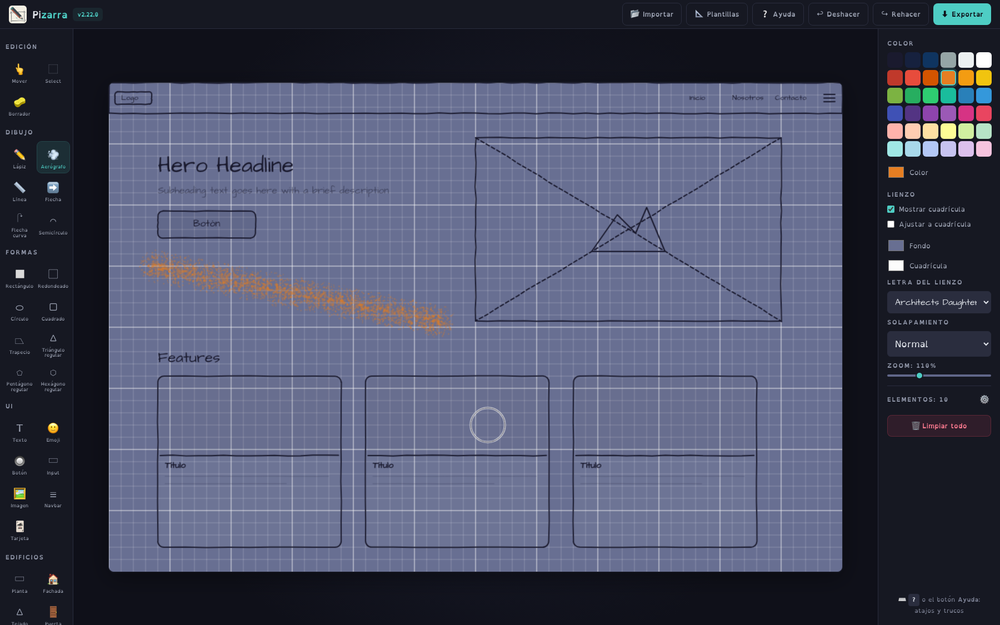
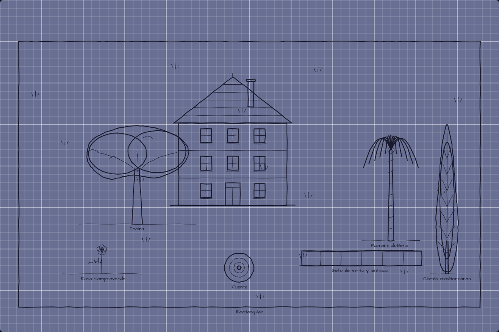

<div align="center">

# ✎ Pizarra

**Wireframes, diagramas y bocetos con estética dibujada a mano — en el navegador y sin instalar nada.**

[](CHANGELOG.md)
[](src/js/)
[](src/scss/)
[](#arquitectura)
[](#tests)
[](LICENSE)



</div>

---

Pizarra es una aplicación de wireframing sobre `<canvas>` escrita en JavaScript puro. **Sin bundler y sin dependencias en runtime**: se clona el repositorio, se abre `index.html` y ya está funcionando. Los estilos se desarrollan en **SCSS (BEM)** y se compilan con **Gulp 5 + Sass** a `css/styles.css`, que viaja compilado dentro del repositorio — por eso usarla sigue sin pedir nada.

- **Cero fricción para usarla** — no hay `npm install` ni compilación para ejecutar la app: abrir el archivo *es* ejecutar la aplicación. Node solo hace falta para desarrollar (estilos y tests).
- **Trazo dibujado a mano, pero estable** — el temblor del estilo *sketchy* nace de un PRNG con semilla por elemento, así que el mismo dibujo se repinta idéntico en cada frame.
- **Tu trabajo es tuyo** — todo vive en el navegador (`localStorage`); nada se envía a ningún servidor. El proyecto se exporta a JSON y se vuelve a importar cuando quieras.
- **Cinco formatos de salida** — PNG, JPG, SVG, HTML y JSON.

## Índice

- [✎ Pizarra](#-pizarra)
  - [Índice](#índice)
  - [Inicio rápido](#inicio-rápido)
  - [Características](#características)
    - [Dibujo y formas](#dibujo-y-formas)
    - [Flechas de nivel diagrama](#flechas-de-nivel-diagrama)
    - [Edificios y Jardín](#edificios-y-jardín)
    - [Edición](#edición)
    - [Exportación](#exportación)
  - [Cómo usar Pizarra](#cómo-usar-pizarra)
  - [Atajos de teclado](#atajos-de-teclado)
  - [Arquitectura](#arquitectura)
    - [Principios de diseño](#principios-de-diseño)
  - [Desarrollo de estilos (SCSS + Gulp)](#desarrollo-de-estilos-scss--gulp)
  - [Tests](#tests)
  - [Documentación del proyecto](#documentación-del-proyecto)
  - [Compatibilidad](#compatibilidad)
  - [Licencia](#licencia)

## Inicio rápido

```bash
git clone https://github.com/JavierTamaritWeb/pizarra.git
cd pizarra
open index.html          # macOS · en Linux: xdg-open · en Windows: start
```

Si prefieres servirla (recomendado para probar el pegado de imágenes y la importación de archivos):

```bash
python3 -m http.server 8000     # → http://localhost:8000
```

Para *usar* la app no hay nada que instalar ni compilar: el CSS ya viene compilado. Para *desarrollar* estilos o pasar los tests, ver [Desarrollo de estilos](#desarrollo-de-estilos-scss--gulp) y [Tests](#tests).

## Características

### Dibujo y formas

| | |
| --- | --- |
| **Trazo a mano alzada** | Lápiz, línea, flecha y flecha curva con jitter determinista: cada elemento guarda su semilla y no "tiembla" entre repintados. |
| **Aerógrafo** | Pulveriza **tono** en vez de trazo: una nube de gotas densa en el eje y difuminada hacia los bordes, con las puntas redondas, y un soplo redondo si se pulsa sin arrastrar. El puntero es el **círculo de la boquilla**, que rodea exactamente lo que se va a pintar. Anchura, grano, densidad y opacidad ajustables, con la paleta entera dentro de sus ajustes; al 100 % la pintura es sólida y por debajo **las pasadas se acumulan**, así que dos trazos cruzados oscurecen el cruce. Puede acotarse a **un rectángulo del lienzo**: fuera de él no cae ni una gota. El elemento guarda solo el eje del trazo —la nube se regenera desde su semilla—, así que el archivo no engorda y las cinco exportaciones dibujan lo mismo. |
| **Tinta (bote de pintura)** | Un clic pinta. Dentro de una forma, la rellena a ella; **fuera, encuentra la zona que cierran los trazos de alrededor** —el rombo que dibujan varias líneas cruzadas, que no es ninguna forma y hasta ahora no se podía colorear— y crea una mancha independiente, por debajo de los trazos: se mueve, se borra y se deshace como cualquier elemento. En el lienzo vacío pinta el fondo entero. **«Cerrar huecos»** (0-12 px) evita que la pintura se escape por las junturas mal cerradas, y el modal trae **cuentagotas**, **pintar toda la selección de golpe** y **sustituir un color por otro en todo el lienzo**. Usa el color de relleno de la app, sólido o translúcido; repintar una zona sustituye su mancha en vez de apilar otra. |
| **Formas** | Rectángulo, redondeado, elipse, cuadrado, trapecio, triángulo, pentágono, hexágono y las **estrellas de 5 y 6 puntas**. Los polígonos regulares se arrastran desde el centro y conservan sus lados iguales; el trapecio admite proporciones libres. |
| **Estrellas** | Las regulares clásicas —pentagrama y Estrella de David—, con el radio interior en el que prolongar el lado de una punta lleva justo a otra punta: rectas completas, no pétalos. Se comportan como un polígono más —relleno, bordes ocultos, giro (36° y 30°) y las cinco exportaciones—, y el borrador y la selección respetan su **silueta**: el hueco entre dos puntas no es dibujo. |
| **Figuras 3D** | Las mismas diez siluetas, en volumen: **prisma**, **pirámide**, **tronco** y **esfera** dan 31 figuras —caja, cubo, cilindro, cono, tetraedro, prisma hexagonal, tronco de cono, prismas estrellados…—. Lo que arrastras es la **cara frontal** y sale sin deformar, porque la proyección es caballera; las aristas de detrás salen **discontinuas**, como en un croquis técnico. Ángulo de fuga (vuelta completa), escorzo y profundidad —en **porcentaje de la cara**, así que una figura pequeña y otra grande salen con las mismas proporciones— se ajustan en el modal de cada herramienta, con miniatura en vivo. Cada sólido nace como un grupo: se mueve, escala y borra de una pieza. |
| **Volumen a tu gusto** | Las figuras 3D se **giran**: la sección, antes de dibujar, en los pasos válidos de su tipo; y la figura entera ya puesta, con `Shift+R` o `←`/`→`. El **grosor y el color de las aristas** y el **relleno de las caras** —opaco o translúcido, con su color y su opacidad— se ajustan en el modal de la propia herramienta. En opaco el sólido se lee macizo; en translúcido se ve a través y las aristas de detrás se siguen leyendo. Y la **pirámide** y el **tronco** ofrecen el modo **«De pie»** (mando **Eje**, en «Proyección»): la sección se tumba sobre el suelo y la figura se levanta sobre el papel, como la pirámide del dibujo de toda la vida. |
| **Semicírculos** | 180° exactos y sin puntas. El arrastre fija el diámetro; después `+`/`−` o su handle ajustan el radio manteniendo la media circunferencia. `Q` convierte una flecha curva en semicírculo y viceversa. |
| **Paleta de 36 colores** | Ordenada por el **arco iris**: abre con la tinta y los neutros, de oscuro a claro, y siguen los vivos y los **doce pastel** recorriendo cada uno de rojo a rosa por naranja, amarillo, verde, turquesa, azul, añil y violeta. Seis filas de seis, una familia por fila, más el selector libre para cualquier otro color. |
| **Relleno** | Color propio por forma, modo sólido o translúcido y opacidad del 0 al 100 %. Vaciar una forma no le hace perder el color: al volver a rellenarla recupera el mismo. |
| **Solapamiento** | El modo **Bordes ocultos** vuelve discontinuos solo los tramos del contorno inferior que otra forma tapa, respetando el orden de capas. |
| **Componentes UI** | Botón, input, imagen, navbar y tarjeta, con etiquetas editables (doble clic). |
| **Letra del lienzo a elegir** | Siete familias autoalojadas: cinco manuscritas —Architects Daughter, Caveat, Patrick Hand, Kalam e Indie Flower—, **OpenDyslexic**, para que la letra pensada para lectores con dislexia llegue también al dibujo y no se quede en la interfaz, y **Montserrat Alternates**, geométrica, para bocetos de aire más tipográfico. Se eligen desde el panel («Lienzo») o desde «Ajustes del texto», con muestra en vivo y cada nombre escrito con su propia letra. La app **no pide ninguna fuente por red**: funciona igual sin conexión. |
| **Estilo del texto** | **Negrita** —con el corte real de la familia donde existe— y **tres sombreados** con color propio: suave, dura y halo. Las medidas se escalan con el tamaño de letra, y todo viaja en los cinco formatos de exportación. |
| **Emoji e imágenes** | Catálogo de 60 emoji en cinco categorías; imágenes pegadas con `Ctrl/Cmd+V` o arrastradas desde el escritorio. |
| **«Select», solo selección** | El clic selecciona cualquier elemento (el grupo completo; doble clic desciende a la pieza) y el arrastre dibuja **siempre** marquesina, incluso empezando encima de un elemento — el gesto que con Mover lo desplazaría. Nada se mueve jamás con ella: en un lienzo denso se enmarca sin miedo y el panel edita lo seleccionado como siempre. |
| **Borrador real** | Borra **lo que se ve**, no la caja: una forma sin relleno se borra por su contorno, así que barrer entre las ventanas de una fachada no se lleva el muro. Y **muerde en vez de fulminar**: recta, flecha, lápiz, flecha curva, aerógrafo y el contorno de las formas sin relleno se **recortan** por donde pasas —cruzar una línea por la mitad, o por donde se cruzan dos trazos, solo borra ese tramo; una mancha de espray se parte en dos—. El **texto, los emojis, las imágenes y los componentes** no tienen trazo que recortar, así que lo que queda de ellos se convierte en imagen: se ve igual y conserva el mordisco, a cambio de dejar de editarse como texto o componente. Si el barrido no quita un solo píxel no pasa nada, ni siquiera un paso de deshacer: cruzar el hueco vacío de una tarjeta ya no se la lleva. Solo desaparecen enteras las **formas rellenas** —su dibujo es una superficie—. Lo borrado no reaparece al mover el dibujo ni viaja oculto dentro del archivo exportado, y cada pasada se deshace como una sola acción. Tamaño ajustable de 4 a 100 px: al elegir la herramienta se abre un modal con previsualización, y volver a pulsarla lo reabre sin salir de ella. |
| **Plantillas** | Landing page, dashboard y formulario, para empezar con estructura. |

### Flechas de nivel diagrama

- **Curvatura con handle**: `Shift` al trazar comba hacia el otro lado, `F` invierte el giro, `+`/`−` ajustan la intensidad y el doble clic en el handle la resetea.
- **Curvas encadenadas**: cada clic añade un tramo continuo y `Ctrl`/`Cmd`+clic termina la cadena con la punta; `Retroceso` deshace el último tramo y `Esc` cancela.
- **Conectores anclados**: suelta un extremo sobre un elemento y la flecha se pega a su borde — al moverlo o redimensionarlo, la flecha lo sigue conservando su curvatura.
- **Etiquetas sobre el trazo**, desplazables a lo largo de la curva, más doble punta, trazo discontinuo, grosor por elemento y dirección invertible (`D`).

### Edificios y Jardín

Dos secciones para bocetar arquitectura y entorno con la misma estética. Ninguna introduce tipos de elemento nuevos: cada arrastre produce líneas, rectángulos, círculos, curvas y texto corrientes, así que la exportación, el undo y el JSON funcionan igual que con el resto del dibujo.



**Edificios** — planta, fachada, tejado, puerta, ventana, balcón, muro, verjas y cancela. La fachada abre un modal con **miniatura en vivo**, tres vistas y los ajustes de plantas, ventanas por planta, pendiente y cubierta, todos sincronizados con el panel lateral. El balcón trae **8 tipos** y su catálogo, como los del jardín, usa **el dibujo real como icono**. El muro se dibuja en **vista de planta o de alzado**, en piedra, hormigón o ladrillo cara vista, con verja opcional arriba y **dieciocho cancelas** a elegir. La herramienta **Verjas** dibuja paños independientes en planta o alzado, ofrece trece diseños de forja con lanzas —incluidos seis inspirados en tradiciones españolas— y regula su altura entre **0 y 350 cm** mediante una miniatura en vivo. Los trece remates tienen hojas diferentes —lanceolada, aguja, ojiva, rombo, laurel, llama, palmeta, hoja facetada, flor de lis, piramidión, cáliz, corazón y rocalla— sin abandonar el repertorio clásico de los maestros forjadores. La herramienta **Cancela** permite colocar cualquiera de los dieciocho estilos como elemento autónomo, en planta o alzado y con altura regulable de **0 a 350 cm**.

**Jardín** — **67 variantes en ocho catálogos**, incluidas **49 especies vegetales** documentadas con nombre botánico y dimensiones adultas. Árboles, arbustos, flores, aromáticas y trepadoras se representan en **planta o alzado**, con etapa joven/en desarrollo/adulta, tamaño 50–150 %, escala 8–50 px/m, color natural o tinta y tres tipos de etiqueta. Parcela, decoración y caminos conservan la planta cenital. En todos los catálogos **el icono es el dibujo real**, conserva la proporción botánica de la especie y mantiene rasgos reconocibles —por ejemplo, el ciprés fastigiado en llama o el pino piñonero aparasolado— aunque el trazo siga siendo esquemático.

Cada edificio y cada pieza de jardín se crea como una **unidad** — un clic la selecciona entera para mover, duplicar o borrar, y el **doble clic** desciende a una parte suelta (`Alt`+clic es el atajo). Todo gesto tiene su vía de un solo puntero: es una regla del proyecto.

<details>
<summary><b>Ver el catálogo completo</b></summary>

| Herramienta | Variantes |
| --- | --- |
| **Planta** (`W`) | Rectangular · en L · en U con jardín · claustro |
| **Fachada** (`1`) | De frente · con tejado · de lado — multiplanta, con la puerta y las ventanas del tipo elegido |
| **Tejado** (`2`) | Dos aguas · un agua · plano · cuatro aguas · mansarda (todos con tejas) |
| **Puerta** (`0`) | Normal · arco · doble · paneles · garaje · y sus versiones solo-marco |
| **Ventana** (`Y`) | Normal · arco · doble · rejilla · óculo · y sus versiones solo-marco |
| **Balcón** | De barrotes · francés · de forja · balaustrada · corrido · acristalado · terraza · mirador |
| **Muro** | Planta o alzado · piedra, hormigón o ladrillo · 18 cancelas · verja superior regulable |
| **Verjas** | Planta o alzado · 13 diseños de forja con lanzas · altura de 0 a 350 cm |
| **Cancela** | Planta o alzado · 18 estilos clásicos y monumentales · altura de 0 a 350 cm |
| **Jardín** (`8`) | Parcela rectangular · cuadrada · redonda · en L · orgánica, con textura de césped |
| **Árbol** (`9`) | Encina · pino piñonero · palmera datilera · olivo · almendro · algarrobo · naranjo · ciprés · higuera · granado · limonero · jacaranda · caqui |
| **Arbusto** (`H`) | Mirto · seto de mirto y lentisco · alcaparra · olivo topiario · romero arbustivo · olivo recortado · lentisco · madroño · jara blanca |
| **Flor** (`X`) | Caléndula · rosa siempreverde · estátice mediterráneo · macizo mediterráneo · boca de dragón · y seis autóctonas y endémicas valencianas: lirio de mar · campanilla valenciana · boca de dragón de roca · silene de Ifach · limonio de Dufour · narciso trompón |
| **Decoración** (`Z`) | Maceta · pozo · regadera · piedra · banco · fuente · reloj de sol (de suelo o de pared) · estanque |
| **Caminos** | Serpenteante o recto, liso o empedrado — las cuatro combinaciones. Del arrastre salen las dos cosas: el **recorrido** por el lado largo y el **grosor** por el corto. Marcando **«Cualquier inclinación»** el recorrido sigue el ángulo exacto del gesto —rotulado junto al puntero mientras arrastras— y el **ancho** pasa a su deslizador, con miniatura en vivo. Todo desde el propio catálogo y sin mantener ninguna tecla |
| **Aromáticas** | Lavanda · romero · tomillo · salvia · maría luisa · hierbabuena · santolina · agave · aloe · chumbera |
| **Trepadoras** | Buganvilla · jazmín · parra · glicinia · hiedra · rosal trepador |

Cada pieza de jardín nace con una **etiqueta** dentro del mismo grupo (se mueve y se borra con ella); puede mostrar nombre común, nombre botánico o dimensiones. Al seleccionar una planta completa aparece **«Editar planta»**, que reabre su ficha y permite sustituir especie o representación en la misma posición; toda la sustitución se deshace en un paso. El tamaño por defecto depende de las dimensiones de la especie y de la escala elegida.

</details>

### Edición

- **Selección múltiple** con marquee, `Ctrl/Cmd+A` o la casilla **«Los clics acumulan selección»**, que aparece al pulsar **Mover** o **«Select»** — las dos herramientas cuyo clic gobierna — y se reabre con el ⚙ de la cabecera «Elementos» sin soltarlas, con cualquier herramienta puesta. Cada clic añade, y un clic sobre lo ya seleccionado lo quita (`Shift`+clic es el atajo); el grupo se arrastra desde cualquier punto de su marco combinado, incluido el espacio vacío entre elementos.
- **Rotación por pasos** (`Shift+R`): cuadrados 45°, trapecios/triángulos/rectángulos 90°, pentágonos y estrellas de 5 puntas 36°, hexágonos y estrellas de 6 puntas 30°. En una selección múltiple cada forma usa su propio paso. Con las formas que guardan su orientación como ángulo —polígonos regulares, estrellas y trapecio— basta con **`←` y `→`**, que pasan de una orientación válida a la siguiente en cada sentido; ahí `↑`/`↓` siguen moviendo.
- **Copiar y pegar** (`Ctrl/Cmd+C` / `V`), también entre pestañas: lo pegado aparece desplazado, queda seleccionado y las flechas ancladas se re-vinculan a sus clones.
- **Posición y tamaño exactos**: con algo seleccionado, el panel deja escribir X, Y, ancho y alto —y el **texto** del elemento cuando lo tiene: el contenido de un texto o el rótulo de un botón, un input, una navbar o una tarjeta—. Antes solo se podía arrastrar y estirar a ojo.
- **Todo lo dibujado se puede recolorear**: elegir un color con algo seleccionado lo aplica a la selección, igual que el grosor o el relleno.
- **Varios elementos se editan a la vez**: con más de uno seleccionado, la caja combinada trae **tiradores** —arrastrar una esquina escala el conjunto en proporción, arrastrar por dentro lo mueve— y los controles del panel enseñan el valor que **todos** comparten, dejándose como están cuando discrepan. Cambiar color, grosor o relleno afecta a toda la selección de una vez.
- **Undo/redo** con historial de 50 pasos.
- **Cuadrícula** con ajuste opcional (`Alt` lo desactiva al vuelo) y **zoom 30–300 %** con auto-ajuste al espacio disponible en pantallas anchas.
- **Papel de plano de obra, y cinco aspectos en un clic**: el lienzo nace con fondo de pizarra azulada y la cuadrícula casi blanca encima, y la fila **«Aspecto»** cambia papel, color de rejilla y rejilla sí/no de una vez — **Plano**, **Blanco**, **Milimetrado**, **Crema** y **Pizarra**—; los dos colores siguen siendo personalizables a mano y todo persiste entre sesiones. Un aspecto describe el papel y nunca toca el color de la tinta (en «Pizarra» hay que elegir un color claro, como en un encerado de verdad). Son ajustes **de pantalla**: no viajan a ninguna exportación, así que lo que se imprime sale siempre sobre blanco limpio y sin rejilla.
- **Autoguardado** en `localStorage`: el trabajo sobrevive al refresco. Si alguna vez no cupiera —un proyecto con varias fotos grandes—, la barra superior lo **avisa** en lugar de callárselo, para que puedas exportar antes de perder nada.
- **Panel contextual**: el panel derecho muestra solo lo que la herramienta activa y la selección usan — «Relleno» con una forma, «Edificios» con Fachada, «Jardín» con un árbol— y agrupa el resto en **Trazo**, **Lienzo** y **Selección**. Con el lápiz pasa de 28 controles a la vista a unos 13, que es lo que más se nota en el cajón de las pantallas estrechas. Nada desaparece: reaparece con su herramienta, y **al seleccionar un elemento vuelven los controles que lo editan**.
- **Cada herramienta abre sus ajustes al pulsarla**, como ya hacían el Borrador y los catálogos. Lápiz, Línea, Flecha, Flecha curva y Semicírculo muestran grosor, color, discontinuo y doble punta; las **diez formas** añaden el relleno entero —rellenar, translúcido, opacidad y color— y, las que guardan su orientación como ángulo, un **giro** con el paso propio de cada una (45° el cuadrado, 36° el pentágono y la estrella de 5 puntas, 30° el hexágono y la de 6…), de modo que la forma nace ya orientada en vez de tener que dibujarla y girarla a golpe de clic. **Texto** ajusta tamaño de letra, grosor y color; **Botón, Input, Imagen, Navbar y Tarjeta** comparten un modal con color, grosor y el **rótulo** con el que nacerán —escribe «Enviar» y coloca tres botones que ya lo digan—; el catálogo de **Emoji** elige también el tamaño (32–96 px), independiente del de letra. Todos llevan **muestra en vivo** dibujada con el renderer real. Cerrar deja la herramienta lista, y volver a pulsarla reabre sus ajustes. En el panel, **cada sección con ajustes propios lleva su ⚙** —«Posición y tamaño», «Relleno», «Texto», «Edificios», «Jardín» y «Elementos»—, y cada uno abre siempre los de esa sección, sin cambiar de herramienta ni soltar la selección. El de «Posición y tamaño» sigue al **tipo de lo seleccionado**, no a la herramienta activa: con un botón seleccionado abre los del componente aunque estés en Mover. Los mismos ajustes siguen en el panel, sincronizados; las únicas herramientas sin modal son Mover y «Select».
- **Pulsar la herramienta de un elemento seleccionado lo edita**: la selección se conserva si es del tipo que esa herramienta crea, y su modal abre mostrando y editando ese elemento — color, relleno, giro, rótulo y también **posición y tamaño**, con los mismos límites que los tiradores (un polígono regular se mantiene cuadrado, un grupo escala en proporción). Empezar a dibujar suelta la selección: crear y editar no se pisan.
- **Interfaz responsive**: la barra de herramientas pasa a dos columnas desde 1201 px y el panel se convierte en un cajón deslizable por debajo de 1100 px.

### Exportación

| Formato | Detalle |
| --- | --- |
| **PNG / JPG** | Imagen rasterizada del lienzo limpio |
| **SVG** | Vectorial escalable, fiel al render |
| **HTML** | Página editable con componentes reales + SVG incrustado para los trazos |
| **JSON** | Proyecto reutilizable — expórtalo e impórtalo después, con validación por tipo de elemento |

**Ningún formato lleva el color del papel ni la cuadrícula**: son ajustes de pantalla, así que el archivo —y lo que se imprima de él— sale sobre blanco limpio, tenga el lienzo el fondo que tenga.

## Cómo usar Pizarra

1. Elige una herramienta en la barra lateral —**Mover** abre la lista, arriba del todo— o con su atajo de teclado.
2. Dibuja sobre el lienzo. Con **Mover** (`V`) seleccionas, desplazas, redimensionas y duplicas.
3. Ajusta color, relleno, cuadrícula y zoom desde el panel derecho, que **enseña solo las secciones que la herramienta activa y la selección usan** — el **grosor** está en el modal de ajustes de cada herramienta, que se abre al pulsarla. Los controles tienen doble uso: **con algo seleccionado editan la selección; sin selección fijan el valor de lo próximo que dibujes.**
4. Exporta como PNG, JPG, SVG o HTML — o guarda el proyecto como JSON para seguir más tarde.

> [!TIP]
> Pulsa `?` en cualquier momento para abrir la ayuda con todos los atajos.

## Atajos de teclado

| Atajo | Acción |
| --- | --- |
| `P` `L` `A` `U` `G` | Lápiz · Línea · Flecha · Flecha curva · Semicírculo (el Aerógrafo y la Tinta van sin atajo) |
| `R` `O` `C` | Rectángulo · Redondeado · Círculo |
| `3` `4` `5` `6` `7` | Triángulo · Cuadrado · Pentágono · Hexágono · Trapecio |
| — | 3D: Prisma, Pirámide, Tronco y Esfera van sin atajo (las 26 letras y los 10 dígitos ya estaban asignados) |
| `T` `J` `B` `I` `M` `N` `K` | Texto · Emoji · Botón · Input · Imagen · Navbar · Tarjeta |
| `V` `E` | Edición: Mover / seleccionar · Borrador |
| `W` `1` `2` `0` `Y` | Edificios: Planta · Fachada · Tejado · Puerta · Ventana (Balcón, Muro, Verjas y Cancela no tienen atajo) |
| `8` `9` `H` `X` `Z` | Jardín: Jardín · Árbol · Arbusto · Flor · Decoración (Caminos, Aromáticas y Trepadoras van sin atajo) |
| `Ctrl/Cmd+Z` · `Ctrl+Y` o `Cmd+Shift+Z` | Deshacer · rehacer |
| `Ctrl/Cmd+D` · `Ctrl/Cmd+A` | Duplicar · seleccionar todo |
| `Ctrl/Cmd+C` · `Ctrl/Cmd+V` | Copiar selección · pegarla (o pegar una imagen del portapapeles) |
| `Shift+R` | Rotar la selección un paso; una figura compuesta gira entera un cuarto de vuelta |
| `←` `→` | Girar la forma seleccionada, si toda la selección guarda su orientación como ángulo (polígonos regulares, estrellas y trapecio), o la figura compuesta si lo es |
| `Supr` · `Esc` | Borrar selección · deseleccionar |
| Flechas (+`Shift`) | Mover la selección 1 px (20 px) — con una forma rotable seleccionada, `←`/`→` giran y solo `↑`/`↓` mueven |
| `F` · `D` · `S` | Invertir giro · invertir dirección · curva en S |
| `Q` | Convertir flecha curva ↔ semicírculo |
| `+` · `−` (+`Shift`) | Ajustar curvatura — en semicírculos, el radio (fino) |
| `?` | Abrir la ayuda con todos los atajos |

Las herramientas que abren catálogo (Edificios y Jardín) muestran su modal de tipos al pulsar el atajo. **Aerógrafo**, **Balcón**, **Muro**, **Verjas**, **Cancela**, **Caminos**, **Aromáticas** y **Trepadoras** no tienen atajo: ya no queda ninguna tecla suelta libre.

## Arquitectura

```text
index.html               Shell de la app (carga src/js/ en orden de dependencia)
css/styles.css           Estilos compilados (artefacto de src/scss/ — no editar a mano)
fonts/                   OpenDyslexic autoalojada (woff2 + su licencia, familia clásica Bitstream Vera)
site.webmanifest         Manifiesto: nombre, colores e iconos para instalar la app
src/
├── img/                  Todas las imágenes: favicon.ico, el juego de iconos,
│                        el logo de la topbar, el PNG fuente y las capturas
├── scss/                Fuente de los estilos: SCSS con BEM
│   ├── abstracts/       _variables (tokens), _fonts (tipografías), _breakpoints, _mixins
│   ├── base/            _tokens (custom properties), _reset, _focus, …
│   ├── components/      Un parcial por bloque BEM: _topbar, _sidebar, _panel, _modal, …
│   └── main.scss        Orquesta los @use en el orden de la cascada
└── js/
    ├── config.js        Constantes: herramientas, colores, tamaños
    ├── sketchy.js       Primitivas de trazo manual (PRNG determinista por elemento)
    ├── arc.js           Geometría de arcos circulares (ajuste de cúbica a semicírculo)
    ├── curve-path.js    Geometría compartida de flechas curvas encadenadas
    ├── shape-rotation.js  Rotación discreta de formas alrededor de su centro
    ├── regular-polygon.js Geometría de cuadrados, triángulos, pentágonos, hexágonos y estrellas
    ├── trapezoid.js     Geometría y rotación del trapecio
    ├── airbrush.js      Nube de gotas del aerógrafo (determinista, sin guardar las gotas)
    ├── eraser.js        Qué toca y qué recorta un trazo de borrador
    ├── flood.js         Zona cerrada bajo el clic de la Tinta (relleno + contorno)
    ├── building.js      Geometría de la sección Edificios
    ├── garden.js        Geometría paisajística del Jardín, en planta y alzado
    ├── solid.js         Figuras 3D en proyección caballera, con líneas ocultas
    ├── renderer.js      Render por tipo de elemento + cuadrícula + selección
    ├── exporter.js      Export PNG/JPG/SVG/HTML/JSON + import validado
    ├── templates.js     Plantillas predefinidas
    └── app.js           Controlador: estado, eventos, undo/redo, conectores
gulpfile.js              Gulp 5: compila src/scss/ y ensambla dist/
dist/                    Publicable minificado (generado con `npm run build`, sin versionar)
tests/                   Suite unitaria (runner nativo de Node)
e2e/                     Suite end-to-end (Playwright)
```

Cada módulo se expone como un global mediante una IIFE y `index.html` los carga en orden de dependencia. No hay imports ni bundler.

### Principios de diseño

- **Un solo estado fuente de verdad** (`state.elements`): objetos planos, serializables e inmutables. Cada edición produce copias, lo que hace el undo trivial y el autoguardado gratuito.
- **Módulos de geometría puros**: `arc`, `curve-path`, `regular-polygon`, `trapezoid`, `airbrush`, `eraser`, `building` y `garden` no tocan el DOM ni el canvas — reciben números y devuelven elementos planos. Por eso se pueden probar sin navegador.
- **Render determinista**: el jitter usa un PRNG sembrado por elemento; el mismo dibujo se repinta idéntico.
- **Import seguro**: todo JSON importado pasa por un validador por tipo de elemento (whitelist de tipos, colores hex, data-URLs de imagen restringidas) que además evita inyecciones en los archivos exportados.

## Desarrollo de estilos (SCSS + Gulp)

Los estilos viven en `src/scss/` y se compilan a `css/styles.css`, que **sí va commiteado** — así «clonar y abrir» sigue funcionando y los tests e2e no necesitan paso previo. Nunca se edita `css/styles.css` a mano: un guard en `tests/smoke.test.js` vigila que sea el artefacto compilado.

```bash
npm install            # una vez (Gulp 5, Sass, terser, stylelint)
npm run watch:css      # recompila al guardar cualquier .scss
npm run build:css      # compilación única
npm run build          # compila + regenera dist/ (publicable: CSS y JS minificados)
npm run lint:css       # stylelint (BEM y buenas prácticas SCSS)
```

Cuatro convenciones que conviene conocer:

- **`1rem` = 10px.** La raíz baja al 62.5% y todas las distancias de la interfaz están en `rem` — si subes el tamaño de fuente del navegador, la interfaz escala contigo. Los breakpoints de las media queries siguen en px a propósito, y el lienzo también (sus coordenadas son px de canvas fijados por JS).
- **Los tokens de diseño viven en [`src/scss/abstracts/_variables.scss`](src/scss/abstracts/_variables.scss)** (colores, dimensiones, movimiento) y `base/_tokens.scss` los emite como custom properties — que deben seguir siéndolo en el CSS final, porque la sidebar se redimensiona en runtime y el lienzo lee `--font-sketch` con `getComputedStyle`.
- **Las tipografías se cambian en un único sitio**: [`src/scss/abstracts/_fonts.scss`](src/scss/abstracts/_fonts.scss) declara `$font-ui` y `$font-sketch`, y de ahí salen las custom properties que usan el CSS **y el propio lienzo** (`config.js` lee `--font-sketch` en runtime). La interfaz usa **OpenDyslexic** (pensada para lectores con dislexia) y el lienzo, una de las cinco manuscritas del catálogo `SKETCH_FONTS`. **Las nueve tipografías van autoalojadas en `fonts/`**, así que la app no pide nada por red: dibuja igual sin conexión y abierta con `file://`. Cada familia manuscrita nueva necesita su `@font-face` y su `.woff2`, y hay guardas que lo comprueban.
- **El orden de `@use` en `main.scss` es la cascada.** Cada bloque BEM tiene su parcial y lleva dentro sus propias media queries; no se reordena ni se alfabetiza.

## Tests

**632 tests unitarios** con el runner nativo de Node, sin ninguna dependencia
de runtime:

```bash
node --test tests/*.test.js           # suite completa
node --test tests/exporter.test.js    # un archivo
```

Los módulos se cargan en un contexto `node:vm` con stubs de canvas y DOM, incluido `src/js/app.js` completo: los tests lanzan gestos reales —puntero, teclado, modales— y leen el resultado del autoguardado, sin ningún hook de test en el código de producción.

**66 tests end-to-end** en un navegador real (Playwright), para lo que un stub no puede juzgar: layout, CSS, foco, acciones por defecto del navegador, los flujos completos de Verjas y Cancela y el Jardín botánico en escritorio, móvil y anchos intermedios.

```bash
npm install && npm run e2e:install    # una vez (descarga Chromium)
npm run test:e2e                      # suite e2e
npm run test:all                      # las dos
```

> [!NOTE]
> La aplicación sigue **sin dependencias en runtime**: `package.json` y `node_modules` existen solo para desarrollar — la suite e2e y la compilación de estilos (Gulp + Sass). `index.html` carga sus `<script>` y su CSS ya compilado directamente, y se abre en el navegador tal cual.

## Documentación del proyecto

| Documento | Contenido |
| --- | --- |
| [`CHANGELOG.md`](CHANGELOG.md) | Historial de versiones |
| [`BUGS.md`](BUGS.md) | Cada error corregido con su síntoma, causa raíz y **guardia de regresión** |
| [`PLAN.md`](PLAN.md) | Plan histórico de las fases iniciales (las fases 1–3 ya están completadas) |
| [`CLAUDE.md`](CLAUDE.md) | Guía de arquitectura para trabajar en el código |

## Compatibilidad

Navegadores de escritorio modernos (Chrome, Edge, Firefox y Safari en versiones recientes). La aplicación usa canvas 2D, `localStorage` y `<dialog>` nativo para los modales.

## Licencia

[MIT](LICENSE) © Javier Tamarit — con [traducción al español](LICENSE.es.txt) a título informativo (la versión vinculante es la inglesa).
